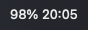
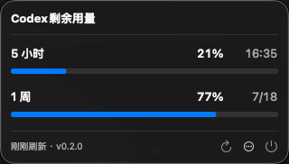

# CodexUsageBar

[简体中文](README.md) | [English](README.en.md)

A lightweight macOS menu bar app that makes checking remaining Codex usage as easy as checking your battery.

## Download

**[Download v0.1.2 for macOS Apple Silicon](https://github.com/ShaneD711/CodexUsageBar/releases/download/v0.1.2/CodexUsageBar-v0.1.2-macos-arm64.zip)**

[SHA-256 checksum](https://github.com/ShaneD711/CodexUsageBar/releases/download/v0.1.2/CodexUsageBar-v0.1.2-macos-arm64.zip.sha256) · [All releases](https://github.com/ShaneD711/CodexUsageBar/releases)

Requires macOS 14 or later, an Apple Silicon Mac, and ChatGPT/Codex installed and signed in.

> The current build is not notarized by Apple. On first launch, open System Settings > Privacy & Security and choose Open Anyway.

## Why It Exists

Checking remaining usage in Codex requires opening the sidebar, clicking the username at the bottom, and then opening Usage Remaining. Repeating this interrupts work and can amplify usage anxiety.

CodexUsageBar puts the remaining percentage and reset time directly in the Mac menu bar, so a glance is enough.

## See It in Action

<p>
  
  &nbsp;&nbsp;
  
</p>

## Features

- Shows the remaining percentage and reset time in the menu bar.
- Shows full usage details when clicked.
- Refreshes automatically and warns when data is stale or unavailable.
- Supports Simplified Chinese and English.
- Processes data locally without uploading usage or conversation content.

## Install

1. Download and extract the ZIP file.
2. Move `CodexUsageBar.app` to `/Applications`.
3. Try to open CodexUsageBar once.
4. Open `System Settings > Privacy & Security` and click `Open Anyway`.
5. Find your remaining usage in the macOS menu bar.

Company- or school-managed Macs may block manual approval. See [Apple's security guidance](https://support.apple.com/guide/mac-help/open-a-mac-app-from-an-unknown-developer-mh40616/mac).

## Privacy

CodexUsageBar reads and displays remaining usage locally. It does not inspect conversations or upload usage data.

## Uninstall

Quit CodexUsageBar from its menu, then move `/Applications/CodexUsageBar.app` to the Trash.

To also clear local data:

```bash
defaults delete com.shaned.CodexUsageBar
```

## License

[MIT License](LICENSE) · Unofficial and not affiliated with OpenAI
